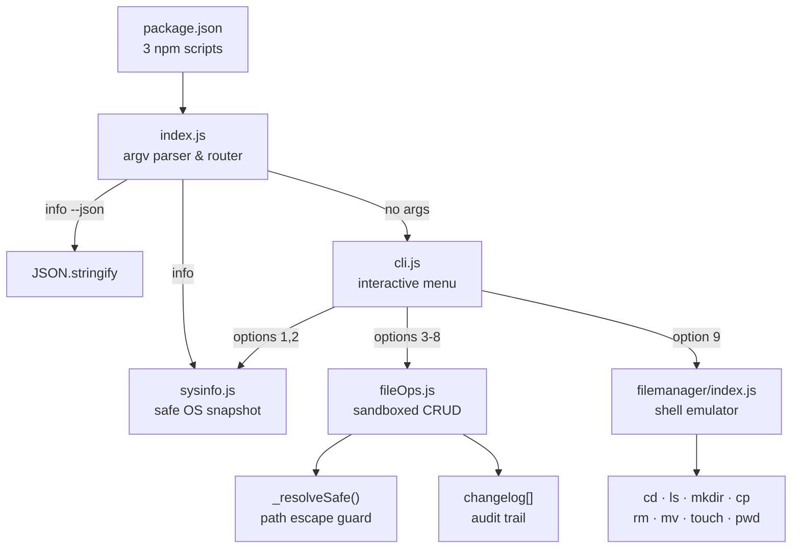
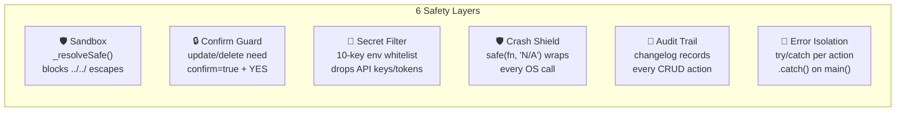
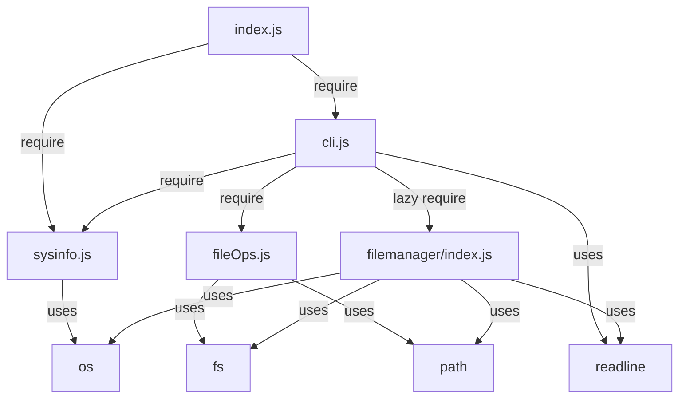
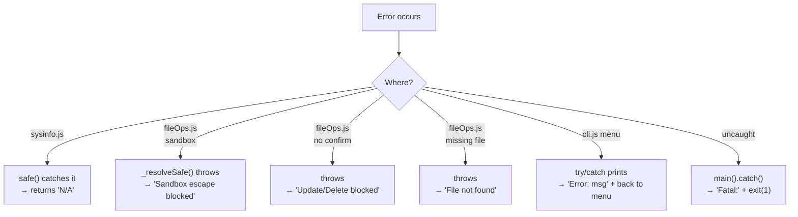

# GlassBox

> **Thunder Hackathon 3.0** — A modular Node.js CLI dev-utility suite.
> Zero dependencies. Pure built-in modules. Safety-first design.

```
┌─────────────────────────────────────────────────────────────┐
│                   inspector (npm start)                     │
│                                                             │
│  ┌──────────────────────┐    ┌───────────────────────────┐  │
│  │   📊 SysInspector    │    │   📁 File Manager         │  │
│  │                      │    │                           │  │
│  │  • System snapshots  │    │  • cd, ls, mkdir, cp      │  │
│  │  • Sandboxed CRUD    │    │  • rm, mv, touch, pwd     │  │
│  │  • Session changelog │    │  • Full filesystem shell  │  │
│  └──────────────────────┘    └───────────────────────────┘  │
│                                                             │
│  Tech: Node.js · os · fs · path · readline · util           │
│  Deps: 0                                                    │
└─────────────────────────────────────────────────────────────┘
```

---

## Quick Start

```bash
git clone <repo-url> && cd inspector
npm start              # interactive menu
npm run info           # one-shot system snapshot
npm run info:json      # JSON output (pipe-friendly)
```

Override the sandbox root:

```bash
node sysinspector/src/index.js --dir /tmp/my-sandbox
```

---

## Architecture



---

## Interactive Menu

When you run `npm start`, you get an arrow-key selector menu:

```
  Sandbox root: /home/user/project
  ↑/↓ or j/k to navigate · Enter to select · q to quit

  ➤ Show system info (console)          ← highlighted (selected)
    Export system info as JSON file
    List files in sandbox directory
    Show session changelog
    Open Cross-Platform File Manager
    Exit
```

Navigate with `↑`/`↓` or `j`/`k`, confirm with `Enter`. Press `q` to quit.

### Walkthrough

```
[Enter on "Show system info"]    → prints OS/CPU/RAM snapshot
[Enter on "List files"]          → prompts for sub-directory, shows entries
[Enter on "Export as JSON"]      → writes sysinfo-<timestamp>.json
[Enter on "Show changelog"]      → lists all session file operations
[Enter on "File Manager"]        → opens embedded shell (see below)
[Enter on "Exit"] or press q     → goodbye!
```

---

## System Snapshot

`npm run info` produces:

```
╔══════════════════════════════════════════════════════════╗
║  SysInspector — System Snapshot                          ║
╚══════════════════════════════════════════════════════════╝

  Timestamp    : 2026-06-21T07:27:13.088Z
  Hostname     : fedora
  OS           : Linux 7.0.12 (linux/x64)
  Node.js      : v24.16.0
  Uptime (s)   : 10077

  CPU
    Model      : AMD Ryzen 5 7530U with Radeon Graphics
    Cores      : 12
    Speed (MHz): 4141

  Memory
    Total (MB) : 15352
    Free  (MB) : 10105
    Used  (%)  : 34.18

  Environment (whitelisted)
    USER       : hariomm
    HOME       : /home/hariomm
    SHELL      : /bin/bash
```

---

## File Manager (Option 9)

A mini shell embedded inside the menu. Starts in your home directory.

| Command | Example | Notes |
|---|---|---|
| `cd` | `cd ~/Projects` | `cd` or `cd ~` → home |
| `ls` / `dir` | `ls -a ~/Documents` | `-a` or `/a` shows hidden |
| `pwd` | `pwd` | Current directory |
| `cat` / `type` | `cat readme.md` | UTF-8 text only |
| `mkdir` / `md` | `mkdir -p a/b/c` | `-p` or `/p` creates parents |
| `touch` | `touch -f file.txt` | `-f` or `/f` overwrites existing |
| `rm` / `del` | `rm -rf folder/` | `-r` required for dirs |
| `rmdir /s` / `rd /s` | `rmdir /s folder/` | Recursive delete |
| `cp` / `copy` | `cp src/ dest/` | Recursive for directories |
| `mv` / `move` / `ren` | `mv old.txt new.txt` | Cross-device fallback |
| `cls` / `clear` | `cls` | Clear terminal screen |
| `exit` | `exit` | Returns to GlassBox menu |

All commands are **case-insensitive** (`DIR`, `Dir`, `dir` all work).  
Both Unix-style (`-a`) and Windows-style (`/a`) flags are supported.  
All commands support `~/` path expansion and quoted paths with spaces.

### Command Alias Reference

| Windows-style | Unix equivalent | Notes |
|---|---|---|
| `dir` | `ls` | `dir /a` = `ls -a` |
| `type` | `cat` | UTF-8 text only |
| `copy` | `cp` | |
| `move` | `mv` | |
| `ren` / `rename` | `mv` | Rename-in-place |
| `del` / `erase` | `rm` | Files only |
| `rmdir` / `rd` | `rm -r` | `rmdir /s` = `rm -rf` |
| `md` | `mkdir` | |
| `cls` / `clear` | — | Clear screen |

---

## Safety Design



### What each layer prevents

| Risk | Layer | How |
|---|---|---|
| Path traversal (`../../etc/passwd`) | Sandbox | Resolves absolute path, verifies prefix match with root + `path.sep` |
| Accidental overwrite/delete | Confirm | `FileOps` throws without `confirm=true`; CLI requires typing `YES` exactly |
| Secret leakage in output | Secret Filter | Only `USER, HOME, SHELL, PATH, LANG, TERM, PWD, EDITOR, USERNAME, NODE_ENV` pass through |
| OS call failure on rare platforms | Crash Shield | `safe()` returns `'N/A'` instead of throwing |
| Untraceable changes | Audit Trail | Every success pushes `{action, target, detail, time}` to changelog |
| Unexpected errors killing the process | Error Isolation | Each menu action is `try/catch`; fatal errors caught by `main().catch()` |

---

## Project Structure

```
inspector/
├── package.json                  # GlassBox root — npm scripts
├── README.md                     # This file
├── sysinspector/
│   ├── project.md                # Detailed visual guide
│   └── src/
│       ├── index.js              # 🚪 Entry — argv parsing & routing
│       ├── cli.js                # 🎮 Interactive readline menu
│       ├── sysinfo.js            # 📊 Safe system data gathering
│       └── fileOps.js            # 📁 Sandboxed CRUD + changelog
└── filemanager/
    └── index.js                  # 🖥️  Cross-platform shell emulator
```

---

## Module Dependency Map



---

## Error Flow



---

## License

MIT

