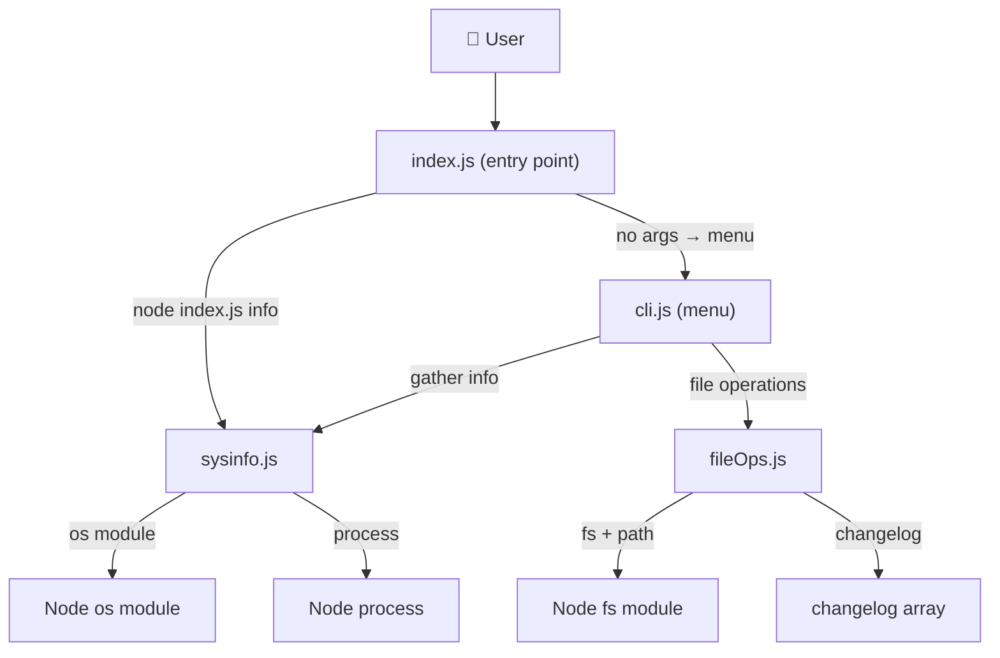
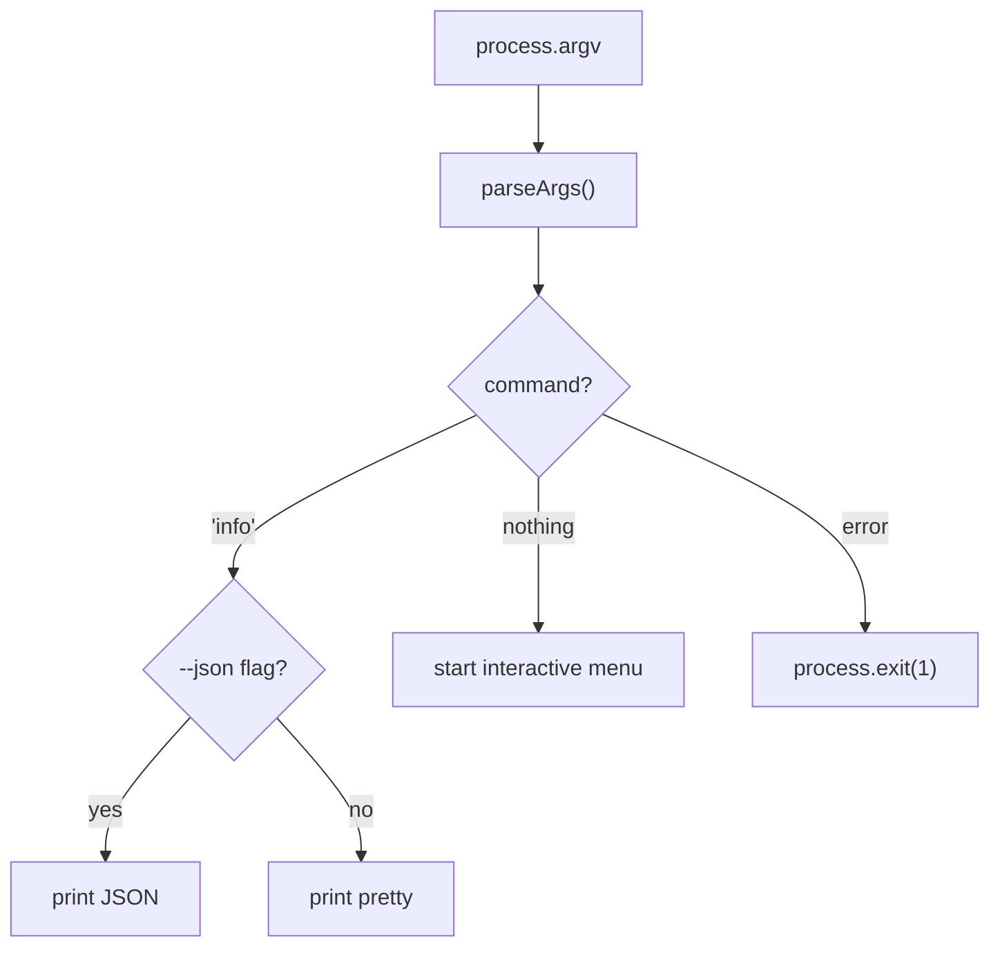
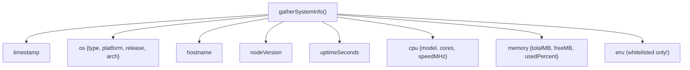
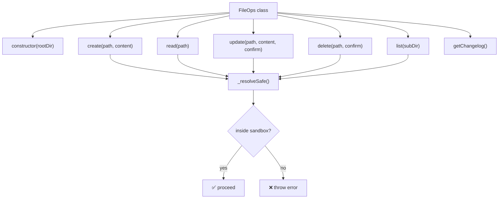
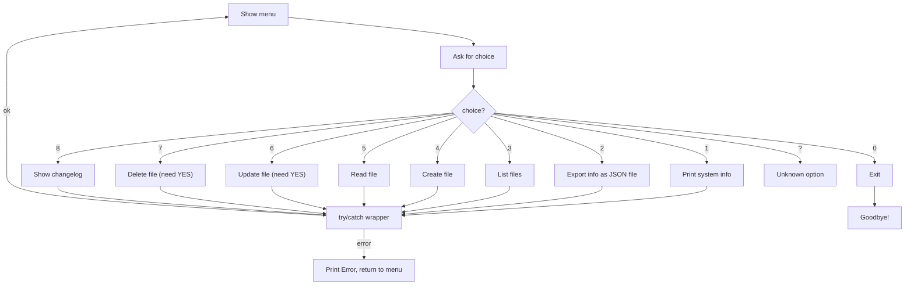
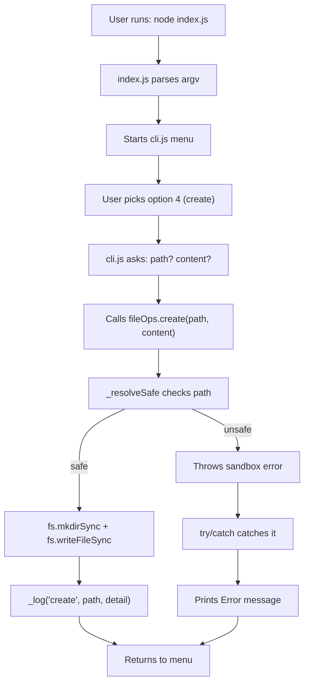

# SysInspector — Full Project Guide

> A Node.js CLI tool that gathers system info and manages files safely inside a sandbox directory.

---

## What It Does (TL;DR)

```
┌─────────────────────────────────────────────────────┐
│                  SysInspector                        │
│                                                     │
│   Feature 1:  Show system info (OS, CPU, RAM, env) │
│   Feature 2:  Create / Read / Update / Delete files │
│               inside a sandboxed directory           │
│                                                     │
│   Safety:     Every dangerous action is guarded     │
└─────────────────────────────────────────────────────┘
```

---

## Project Structure

```
sysinspector/
├── package.json          ← npm scripts & metadata
├── README.md             ← formal docs
├── project.md            ← this file (visual guide)
└── src/
    ├── index.js          ← 🚪 Entry point — parses args, routes traffic
    ├── cli.js            ← 🎮 Interactive menu (readline)
    ├── sysinfo.js        ← 📊 Gathers system data safely
    └── fileOps.js        ← 📁 Sandboxed file CRUD + changelog
```

---

## How the Pieces Connect



**In simple words:**
1. You run the program → `index.js` decides what to do
2. If you want info → `sysinfo.js` collects it from the OS
3. If you want the menu → `cli.js` shows options and asks `fileOps.js` to handle files
4. `fileOps.js` is the bouncer — it checks every file path and blocks anything suspicious

---

## File-by-File Breakdown

---

### `src/index.js` — The Front Door

**Job:** Read command-line arguments, decide what mode to run, and delegate.

```
User types:                    What happens:
─────────────────────────────────────────────────
node index.js              →   Launch interactive menu
node index.js info         →   Print system info (pretty)
node index.js info --json  →   Print system info (JSON)
--dir /some/path           →   Change the sandbox root
```

**Flow diagram:**



**Key snippet** — argument parsing with zero dependencies:
```js
function parseArgs(argv) {
  const args = argv.slice(2);
  const opts = { command: null, json: false, dir: process.cwd() };

  for (let i = 0; i < args.length; i++) {
    const arg = args[i];
    if (arg === '--json')           opts.json = true;
    else if (arg === '--dir')       opts.dir = path.resolve(args[++i]);
    else if (!arg.startsWith('--')) opts.command = arg;
  }
  return opts;
}
```

**Safety net** — catches anything that slips through:
```js
main().catch((err) => {
  console.error(`Fatal: ${err.message}`);
  process.exit(1);
});
```

---

### `src/sysinfo.js` — The System Reporter

**Job:** Collect OS, CPU, memory, and environment info without ever crashing.

**The problem it solves:** OS calls can fail on weird platforms. If `os.cpus()` throws, the whole program shouldn't die.

**The solution — `safe()` wrapper:**

```js
function safe(fn, fallback = 'N/A') {
  try {
    const result = fn();
    return result !== undefined && result !== null ? result : fallback;
  } catch {
    return fallback;   // ← never crashes, always returns something
  }
}
```

**How it's used — every call is wrapped:**
```js
hostname:      safe(() => os.hostname()),       // 'fedora' or 'N/A'
nodeVersion:   safe(() => process.version),      // 'v24.16.0' or 'N/A'
uptimeSeconds: safe(() => os.uptime()),          // 13505 or 'N/A'
```

**What the output looks like:**



**The env whitelist — why it matters:**

```
process.env has ~80+ variables including:
  ├─ USER, HOME, SHELL     ← safe to show ✅
  ├─ PATH, TERM, LANG      ← safe to show ✅
  ├─ AWS_SECRET_ACCESS_KEY ← DANGER! ❌
  ├─ DATABASE_URL          ← DANGER! ❌
  └─ GITHUB_TOKEN          ← DANGER! ❌

We only allow these 10:
  USER, USERNAME, HOME, SHELL, LANG,
  PATH, TERM, PWD, EDITOR, NODE_ENV
```

```js
const ENV_WHITELIST = ['USER', 'USERNAME', 'HOME', 'SHELL', 'LANG',
                        'PATH', 'TERM', 'PWD', 'EDITOR', 'NODE_ENV'];

const env = {};
for (const key of ENV_WHITELIST) {
  if (process.env[key] !== undefined) {
    env[key] = process.env[key];  // only copy whitelisted keys
  }
}
```

**Edge case — empty CPU array:**
```js
const cpus = safe(() => os.cpus(), []);
const cpuInfo = cpus.length > 0
  ? { model: cpus[0].model, cores: cpus.length, speedMHz: cpus[0].speed }
  : { model: 'N/A', cores: 'N/A', speedMHz: 'N/A' };  // graceful fallback
```

---

### `src/fileOps.js` — The Sandboxed File Manager

**Job:** CRUD operations on files, but locked inside a sandbox directory.

**The big picture:**



**The `_resolveSafe()` guard — explained visually:**

```
Sandbox root: /home/user/myproject

User asks for:  "src/index.js"
  → resolves to: /home/user/myproject/src/index.js
  → starts with root? YES ✅ → proceed

User asks for:  "../../etc/passwd"
  → resolves to: /etc/passwd
  → starts with root? NO ❌ → BLOCKED!
```

```js
_resolveSafe(relativePath) {
  const resolved = path.resolve(this.root, relativePath);
  if (resolved !== this.root &&
      !resolved.startsWith(this.root + path.sep)) {
    throw new Error(`Sandbox escape blocked: "${relativePath}"`);
  }
  return resolved;
}
```

**The confirm guard — two layers of protection:**

```
Layer 1: fileOps.js                    Layer 2: cli.js
─────────────────────                  ──────────────────────
update(path, content, confirm)         User types "YES" at prompt
  if (confirm !== true) throw!    ←──    only then pass confirm=true
```

```js
// fileOps.js — blocks without confirm
update(relativePath, newContent, confirm = false) {
  if (confirm !== true) {
    throw new Error('Update blocked: confirm flag is not set.');
  }
  // ... proceed with overwrite
}
```

```js
// cli.js — asks the human first
const confirmation = await ask('Type YES to confirm: ');
if (confirmation !== 'YES') {
  console.log('Aborted.');
  break;
}
fileOps.update(relPath, newContent, true);  // ← only place confirm=true lives
```

**The changelog — every action is recorded:**

```js
_log(action, target, detail) {
  this.changelog.push({
    action,                        // 'create', 'read', 'update', 'delete'
    target,                        // 'hello.txt'
    detail,                        // 'Created (42 bytes)'
    time: new Date().toISOString() // '2026-06-20T06:19:58.462Z'
  });
}
```

Example changelog after a session:
```
[2026-06-20T06:19:58Z]  CREATE   hello.txt    — Created (42 bytes)
[2026-06-20T06:19:59Z]  READ     hello.txt    — Read (42 bytes)
[2026-06-20T06:20:00Z]  UPDATE   hello.txt    — Overwritten (55 bytes)
[2026-06-20T06:20:01Z]  DELETE   hello.txt    — Deleted
```

---

### `src/cli.js` — The Interactive Menu

**Job:** Show a numbered menu, handle user input, catch all errors gracefully.

**The menu loop:**



**Error handling — nothing crashes the menu:**
```js
while (running) {
  const choice = await ask('Enter choice [0-8]: ');
  try {
    running = await handleChoice(choice);
  } catch (err) {
    console.log(`Error: ${err.message}`);  // print error, loop back
  }
}
```

**The YES confirmation flow (options 6 & 7):**

```
User picks 6 (update):
  1. "File path?"       → user types "notes.txt"
  2. "New content?"     → user types "updated stuff"
  3. "Type YES:"        → user types...
     ├─ "yes"           → ❌ Aborted (must be uppercase YES)
     ├─ "y"             → ❌ Aborted
     ├─ ""              → ❌ Aborted
     └─ "YES"           → ✅ Proceeds with fileOps.update(..., true)
```

**Key rule:** `cli.js` is the **only file** allowed to pass `confirm=true` into FileOps. No other module can bypass the confirmation.

---

## Safety Design — Visual Summary

```
┌─────────────────────────────────────────────────────────────────┐
│                     SAFETY LAYERS                                │
├─────────────────────────────────────────────────────────────────┤
│                                                                 │
│  1. CRASH PROTECTION                                            │
│     safe(fn, 'N/A') wraps every OS call                         │
│     → Missing data shows 'N/A', never throws                    │
│                                                                 │
│  2. SECRET PROTECTION                                           │
│     Env whitelist (10 keys only)                                │
│     → API keys, tokens, DB URLs never appear in output          │
│                                                                 │
│  3. SANDBOX PROTECTION                                          │
│     _resolveSafe() checks every path                            │
│     → ../../etc/passwd is blocked before touching filesystem    │
│                                                                 │
│  4. DESTRUCTIVE ACTION PROTECTION                               │
│     update() and delete() need confirm=true                     │
│     CLI requires typing "YES" exactly                           │
│     → No accidental overwrites or deletions                     │
│                                                                 │
│  5. AUDIT TRAIL                                                 │
│     Every successful action → changelog entry with timestamp    │
│     → Full history of what happened in the session              │
│                                                                 │
│  6. ERROR ISOLATION                                             │
│     try/catch around every menu action                          │
│     .catch() on main() for fatal errors                         │
│     → One bad input doesn't kill the program                    │
│                                                                 │
└─────────────────────────────────────────────────────────────────┘
```

---

## Data Flow — Full Lifecycle



---

## Quick Command Reference

```bash
# Launch interactive menu (sandbox = current directory)
node src/index.js

# Launch with custom sandbox directory
node src/index.js --dir /tmp/my-sandbox

# One-shot system info (human-readable)
node src/index.js info

# One-shot system info (JSON — pipe-friendly)
node src/index.js info --json

# npm shortcuts
npm start          # → node src/index.js
npm run info       # → node src/index.js info
npm run info:json  # → node src/index.js info --json
```

---

## What Each File Imports

```
index.js
  ├─ path (built-in)
  ├─ ./sysinfo  → gatherSystemInfo
  └─ ./cli      → startInteractiveMenu, printSystemInfo

cli.js
  ├─ readline (built-in)
  ├─ fs (built-in)
  ├─ path (built-in)
  ├─ ./sysinfo  → gatherSystemInfo
  └─ ./fileOps  → FileOps

sysinfo.js
  └─ os (built-in)

fileOps.js
  ├─ fs (built-in)
  └─ path (built-in)
```

**Zero external dependencies** — the entire project uses only Node.js built-in modules.

---

## Error Handling Cheat Sheet

| What can go wrong | Where it's caught | What the user sees |
|---|---|---|
| OS call fails (e.g. `os.cpus()`) | `safe()` in sysinfo.js | `'N/A'` in output |
| Path escapes sandbox (`../../`) | `_resolveSafe()` in fileOps.js | `Error: Sandbox escape blocked: ...` |
| File not found | `existsSync` check in fileOps.js | `Error: File not found: ...` |
| File already exists (create) | `existsSync` check in fileOps.js | `Error: File already exists: ...` |
| Update without confirm | `confirm` check in fileOps.js | `Error: Update blocked: ...` |
| Delete without confirm | `confirm` check in fileOps.js | `Error: Delete blocked: ...` |
| User types wrong menu number | `default` case in cli.js | `Unknown option. Try again.` |
| Any thrown error in menu | `try/catch` in cli.js loop | `Error: <message>` + back to menu |
| Totally unexpected crash | `.catch()` in index.js | `Fatal: <message>` + exit code 1 |
